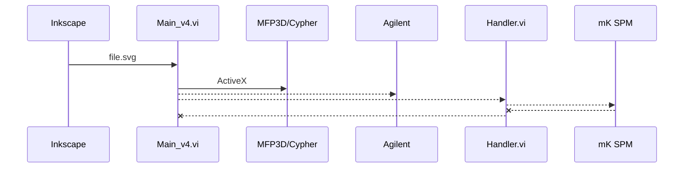

# General AFM Lithography
Below was rendered using stackedit.io
## LaTeX
$$
x = \frac{x^2}{x}
$$
## UML diagrams
You can render UML diagrams using [Mermaid](https://mermaidjs.github.io/). For example, this will produce a sequence diagram:

## FAQ
### What is this repository for?

* Conducting AFM Lithography
* This release supports Asylum MFP3D and Cypher AFMs and simulation mode. There are existing branches that support Agilent and Nanosurf AFMs. Bruker is under devleopment. All supported AFMs will be unified in a future release

### How do I get set up?

* Summary of set up: Install using JKI VI Package Manager
* Configuration: None
* Dependencies: National Instruments Vision Development Module, JKI State Machine, LevyLab FileUtilities

### Instructions

1. Define the toolpath using Inkscape v0.48 (https://inkscape.org/release/inkscape-0.48/)
2. Run Main_v4.vi
  a. Load a Background Image from the AFM
  b. Load your Inkscape file
  c. Use the "Patterns and Writing" tab to define writing parameters (e.g. tip speed and voltage for each shape)
  d. Check that the patterns you want to write overlap the AFM image using the "Rendered 2D Image" tab.
  e. When you are ready to execute click the "Run" button.

### Who do I talk to?

* Patrick Irvin: p.irvin@levylab.org
* Joe Albro: joe.albro@levylab.org